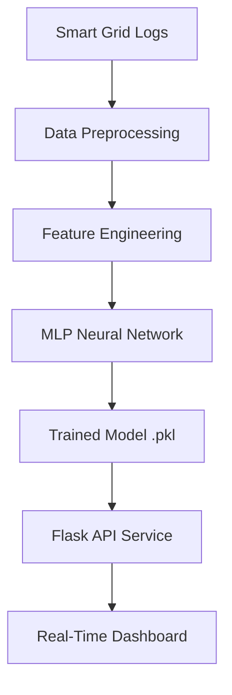

# ⚡ AI-Powered Energy Consumption Forecasting System

Prototype Link : [Demo Link](https://ai.studio/apps/6c20977c-0d4c-488f-ab9a-5b4a91cae87d)

---

## 📖 Overview
This project is a full-stack simulation of an **Industrial Energy Forecasting System**. It bridges the gap between raw data science and real-world application by providing both a **Real-Time Dashboard** and a **Production-Ready Python Backend**.

### 🔴 The Problem
Power grids often fail to balance supply and demand, leading to blackouts or massive energy wastage. Traditional monitoring is manual and reactive.

### 🟢 The Solution
An AI-driven system that predicts future demand with high precision, allowing for proactive grid management and cost reduction.

---

## 🌟 Key Features

### 1. Interactive Simulation Dashboard
- **Live Forecasting**: Real-time visualization of "Actual vs. Predicted" energy loads.
- **Dynamic Training**: Simulate the retraining of a Multi-Layer Perceptron (MLP) Neural Network.
- **Behavioral Modeling**: Synthetic data that mirrors real human routines (workday peaks, weekend dips).

### 2. Professional Python Implementation (`/python_project`)
- **Modular Pipeline**: Clean separation of data generation, training, and inference.
- **Flask API**: A RESTful endpoint simulating how IoT devices would request predictions.
- **Portfolio Ready**: Structured according to industry standards for immediate GitHub deployment.

---

## 🏗️ System Architecture

1.  **Data Layer**: Hourly energy consumption logs (kWh).
2.  **Feature Layer**: Extraction of temporal features (Hour of Day, Day of Week).
3.  **Model Layer**: Multi-Layer Perceptron (MLP) Regressor for non-linear pattern recognition.
4.  **Service Layer**: Flask API providing instant inference.

---

## 🛠️ Tech Stack

| Category | Tools |
| :--- | :--- |
| **Frontend** | React 19, Tailwind CSS, Recharts, Framer Motion |
| **Data Science** | Pandas, NumPy, Scikit-Learn |
| **Backend** | Flask (Python), TypeScript (Simulation) |
| **Deployment** | GitHub Ready, Modular Structure |

---

## 🚀 Getting Started

### For the Dashboard (Preview)
Simply view the hosted application to interact with the simulation. Use the **"Retrain Model"** button to see the AI workflow in action.

### For your GitHub Portfolio
1.  Navigate to the `/python_project` directory.
2.  Follow the internal `README.md` for local setup instructions.
3.  Upload these files to your personal GitHub to showcase your skills to recruiters.

---

## 👨‍🎓 Learning Outcomes
- **Domain Knowledge**: Understanding energy load profiles and grid optimization.
- **ML Engineering**: Implementing regression models for time-series forecasting.
- **Full-Stack Integration**: Connecting a machine learning model to a user interface.
- **Documentation**: Learning how to present technical projects professionally.

---

  Built with ❤️ for the next generation of Clean Tech Engineers.

